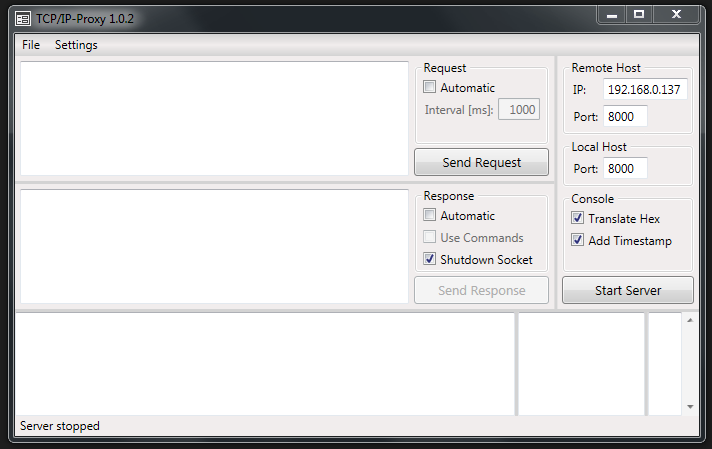

# TcpIpProxy

A TCP/IP client and server able to translate hex values contained in a lightweight .NET 4.5 app

## Getting Started

These instructions will get you a copy of the project up and running on your local machine for development and testing purposes. See deployment for notes on how to deploy the project on a live system.

### Prerequisites

* [Visual Studio 2015/2017](https://www.visualstudio.com/de/vs/) - Fully-featured IDE for Android, iOS, Windows, web, & cloud

## Deployment

Just copy over `TcpIpProxy.exe` and run it. An installation is not needed.

## [Documentation](https://robinhartmann.github.io/TcpIpProxy/)

## Built With

* [Costura](https://github.com/Fody/Costura) - Embeds dependencies as resources

## Authors

* **Robin Hartmann** - *Initial work* - [RobinHartmann](https://github.com/RobinHartmann)

## License

This project is licensed under the MIT License - see the [LICENSE](LICENSE) file for details

## Acknowledgments

* Special thanks to [mobisys GmbH](https://github.com/mobisysgmbh) for letting me publish this project and being a great place to work
