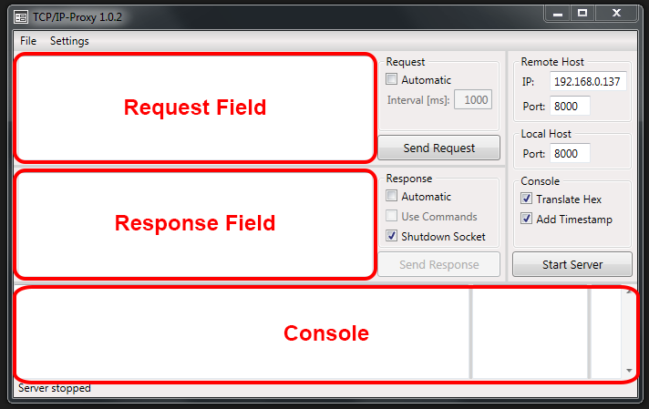
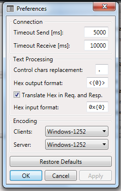

# Introduction

## Abstract

The *TCP/IP-Proxy* contains a client and a server component, so it can communicate with other TCP/IP sockets.

As a client it can send requests to a server manually or in certain time intervals. As a server it can respond to a connected client manually or automatically and it can choose a response depending on the request.

The console can display received data as raw text or in hexadecimal representation. Moreover, hexadecimal data can be entered and sent.

## Setup

To be able to use the *TCP/IP-Proxy*, .NET Framework version 4.5 or higher has to be installed on your computer.

To start the application, you just have to execute `TcpIpProxy.exe`. An installation is not needed.

## User Interface

### Main Window

### Preferences Window

